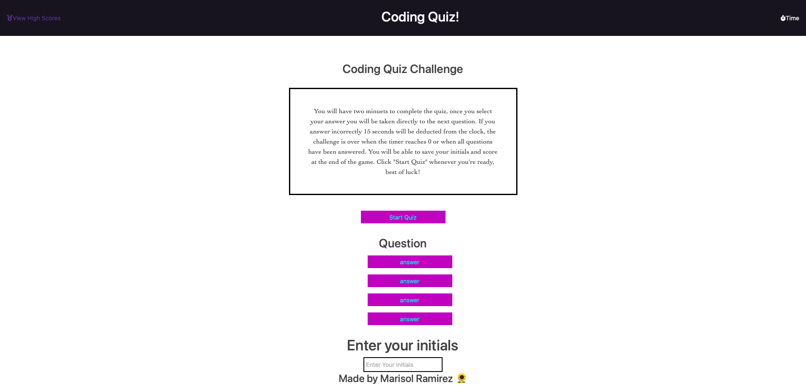

# APIcodequiz
 Module 4 Web API's Code Quiz

The purpose of this assignment is to create a timed quiz on JavaScript fundamentals that stores high scores (localStorage) so you can compare progress.

## Task List 
- [x] Add a timer functionality to start when quiz begins.
- [x] Ability to be presented with next question after answering previous question without having to click more buttons.
- [x] Deduct time when a question is answered incorrectly 
- [x] Add the ability to end the quiz when timer reaches 0 or all questions are answered.
- [x] Add the ability to save (localStorage) score and initials (input).

## Languages Used

* HTML
* CSS
* JavaScript

## User Story 
AS A coding boot camp student
I WANT to take a timed quiz on JavaScript fundamentals that stores high scores
SO THAT I can gauge my progress compared to my peers.

## Acceptance Criteria

GIVEN I am taking a code quiz
WHEN I click the start button
THEN a timer starts and I am presented with a question
WHEN I answer a question
THEN I am presented with another question
WHEN I answer a question incorrectly
THEN time is subtracted from the clock
WHEN all questions are answered or the timer reaches 0
THEN the game is over
WHEN the game is over
THEN I can save my initials and score.

## Link to Github Repository

## Link to Deployed Application

## Screenshot

Here is a snapshot of the website:
* js files have not been started yet.

